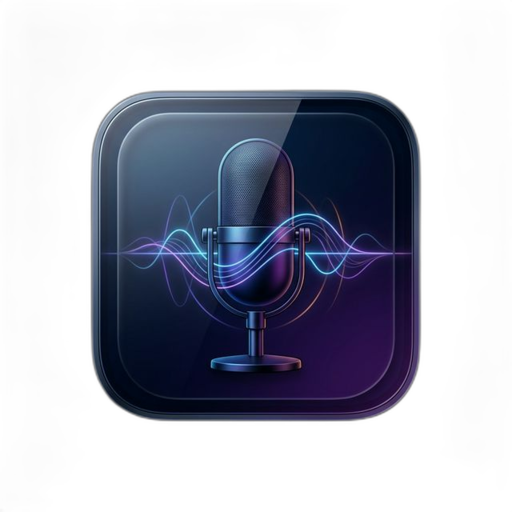

<p align="center">
  
</p>

<h1 align="center">NoType</h1>

<p align="center">
  一个面向 macOS 的菜单栏语音输入应用。<br>
  按下快捷键，说话，文字直接落到你当前聚焦的输入框里。
</p>

<p align="center">
  基于 SwiftUI、AppKit、SwiftData 和 Doubao Streaming ASR 构建。
</p>

## NoType 是什么

NoType 想解决的是一件很具体的事：当你已经在写代码、回消息、记笔记、填表单时，不想切到另一个转写工具，也不想手动复制粘贴，只想按一下快捷键就开始说话，然后让文字回到你原本正在操作的地方。

它不是一个“大而全”的输入法，也不是一个重型会议纪要系统，而是一个更轻、更近、更适合桌面工作流的语音输入工具。

## 为什么值得用

- 菜单栏常驻，不抢桌面主场景
- 全局快捷键启动，适合高频短句输入
- 识别结果优先直接写入当前控件，失败时自动回退到粘贴
- 历史记录本地保存，方便回看刚刚说过什么
- 内置连接诊断，排查 Doubao 鉴权和协议问题时比黑盒工具更直接
- 配置、打包、调试链路都在仓库里，适合继续二开

## 当前已经支持

- 菜单栏常驻应用，带 Setup、Settings、History 和录音 HUD
- 全局快捷键启动/停止语音输入，默认 `Option + Space`
- 选择麦克风、切换识别语言、控制是否自动插入文本
- 通过 Accessibility 直接插入文本，必要时回退到剪贴板粘贴
- 本地保存识别历史，包括目标应用、麦克风、状态、耗时和转写结果
- Doubao 连接诊断，便于排查握手、鉴权和协议问题
- Dock 图标显示、开机启动、历史保留天数等行为配置

## 适合谁

- 希望在 macOS 上做“按键即说话”的轻量语音输入用户
- 已经在用火山引擎 Doubao ASR，希望接入桌面工作流的人
- 想研究菜单栏应用、全局热键、Accessibility 文本插入、SwiftData 的开发者
- 想把现有 MVP 继续打磨成可分发产品的开源贡献者

## 项目状态

NoType 目前处于早期可用阶段：

- 主路径已经可跑通
- 适合自用、调试和持续迭代
- 还没有把安装、签名、分发、兼容性打磨到“普通用户无脑即用”的程度

如果你想要一个可修改、可验证、可继续演进的基础版本，这个仓库已经足够开始。

## 技术栈

- Swift 6
- SwiftUI + AppKit
- SwiftData
- macOS Accessibility / Carbon Hotkey / AVFoundation
- Doubao Streaming ASR WebSocket 协议

## 系统要求

- macOS 14+
- 已开通的 Doubao 流式语音识别资源
- 允许应用访问：
  - Microphone
  - Accessibility

## 快速开始

### 直接运行

```bash
swift run NoType
```

应用启动后会出现在菜单栏。第一次使用时，先打开 `Setup` 完成权限授权，再到 `Settings` 配置 Doubao 凭证。

### 构建并安装到 `/Applications`

```bash
./scripts/build_app.sh
```

这个脚本会：

- 以 `release` 模式构建可执行文件
- 生成应用图标
- 组装 `.app` bundle
- 使用 ad-hoc 签名
- 安装到 `/Applications/NoType.app`

### 在 Xcode 中开发

先生成工程：

```bash
ruby scripts/generate_xcodeproj.rb
open NoType.xcodeproj
```

然后在 Xcode 中：

1. 选择 `NoType` target。
2. 打开 `Signing & Capabilities`。
3. 启用 `Automatically manage signing`。
4. 选择你的开发团队。
5. Run 或 Archive。

本地开发通常使用 `Apple Development` 签名即可；如果要分发给其他机器，需要补全 `Developer ID` 和 notarization 流程。

## 配置 Doubao ASR

在应用的 `Settings` 中填写：

- `App ID`
- `Resource ID`
- `Access Token`

当前界面里给出了 1.0 和 2.0 资源示例：

- 1.0 小时版：`volc.bigasr.sauc.duration`
- 1.0 并发版：`volc.bigasr.sauc.concurrent`
- 2.0 小时版：`volc.seedasr.sauc.duration`
- 2.0 并发版：`volc.seedasr.sauc.concurrent`

存储方式：

- `Access Token` 存在 macOS Keychain
- 其他设置存到本地 `UserDefaults`
- 历史记录使用 SwiftData，存放在应用支持目录

## 使用流程

1. 打开菜单栏应用，完成麦克风和辅助功能授权。
2. 在 `Settings` 中配置 Doubao 凭证。
3. 选择快捷键、麦克风和识别语言。
4. 在任意输入框聚焦后，按快捷键开始录音。
5. 再按一次快捷键，或在菜单栏中点 `Stop Dictation`，等待转写完成。
6. 若启用了 `Auto insert`，结果会自动写入当前应用；否则会保留识别结果与历史记录，但不主动插入文本。

## 诊断与排错

### 图形界面诊断

`Settings -> Diagnostics -> Run Connection Test`

这个诊断会输出：

- WebSocket 握手是否成功
- 服务端是否响应 client request
- 最终音频帧后的协议行为
- 解析后的错误信息或中间日志

### 命令行诊断

```bash
swift run NoType --diagnose-asr
```

也可以通过环境变量临时覆盖本地配置：

```bash
NOTYPE_APP_ID=your_app_id \
NOTYPE_RESOURCE_ID=volc.seedasr.sauc.duration \
NOTYPE_ACCESS_TOKEN=your_token \
swift run NoType --diagnose-asr
```

如果没有提供环境变量，诊断命令会回退到本地设置和 Keychain 中已保存的凭证。

## 验证

```bash
swift build
swift test
```

## 项目结构

```text
Sources/NoType/App         应用状态、生命周期和主流程
Sources/NoType/Models      配置、状态和数据模型
Sources/NoType/Services    音频采集、热键、ASR、权限、文本插入等服务
Sources/NoType/Views       菜单栏、设置、历史、HUD、引导界面
Sources/NoType/Support     诊断命令和协议辅助工具
scripts/                   构建、图标、Xcode 工程生成脚本
packaging/                 App bundle 资源与图标
Tests/NoTypeTests          测试
```

## Roadmap

- [x] 菜单栏主流程、快捷键、录音、转写、文本插入
- [x] 本地历史记录与基础设置
- [x] Doubao 图形界面和命令行诊断
- [ ] 更完整的安装与分发流程
- [ ] 更稳定的跨应用文本插入兼容性
- [ ] 更清晰的产品级 onboarding 和错误提示
- [ ] 自动更新、发布产物和更完整的 CI

## 参与共建

欢迎提 issue、提 PR，或者直接把它 fork 成更适合你自己的版本。

如果你准备参与修改，比较值得先看的目录是：

- `Sources/NoType/App`
- `Sources/NoType/Services`
- `Sources/NoType/Views`
- `scripts/`

## 当前边界

- 当前目标平台只有 macOS。
- 全局快捷键使用稳定组合键，不支持裸 `Fn`。
- 文本插入依赖 Accessibility；某些应用中会回退到模拟粘贴。
- Doubao 协议兼容性以当前仓库实现为准，升级资源协议时需要重新核对字段和握手行为。
- 它已经是一个能工作的 MVP，但还不是面向普通用户大规模分发的最终形态。
