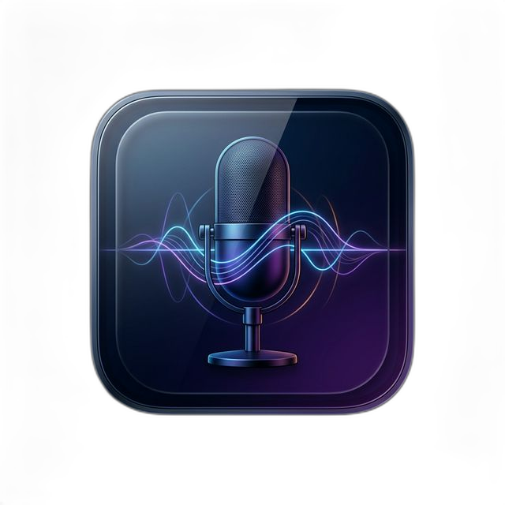

<p align="center">
  
</p>

<h1 align="center">NoType</h1>

<p align="center">
  一个面向 macOS 的菜单栏语音输入应用。<br>
  按下快捷键，说话，文字回到你当前聚焦的输入框里。
</p>

<p align="center">
  基于 SwiftUI、AppKit、Codex / Doubao 语音转写、AI Rewrite 和英文翻译构建。
</p>

## NoType 是什么

NoType 想解决的是一件很具体的事：当你已经在写代码、回消息、记笔记、填表单时，不想切到另一个转写工具，也不想手动复制粘贴，只想按一下快捷键就开始说话，然后让文字回到你原本正在操作的地方。

它不是一个“大而全”的输入法，也不是一个重型会议纪要系统，而是一个更轻、更近、更适合桌面工作流的语音输入工具。

## 为什么值得用

- 菜单栏常驻，不抢桌面主场景
- `Option + Space` 启动语音输入，`Option + Shift + Space` 翻译成英文
- Codex 流式转写复用本机登录态，边录边识别，结束录音后直接输入；也可选择 Doubao
- Doubao 模式可选 `AI Rewrite`，把口语稿整理成更适合直接发送或交给 AI 执行的文字
- 统一走剪贴板 + `Cmd + V` 注入，对非原生编辑器更稳
- 粘贴前会在 CJK 输入法下临时切到 ASCII，粘贴后恢复输入法和原剪贴板
- 配置、打包、调试链路都在仓库里，适合继续二开

## 当前已经支持

- 仅菜单栏运行的 macOS 14+ 应用，带 `Setup`、`Settings` 和底部悬浮 HUD
- `Option + Space` 全局热键，`Option + Shift + Space` 进入英文翻译；`Option + Esc` 可取消
- 同一主热键按一次开始录音，再按一次结束
- Codex 内部听写：复用本机登录态，自动识别语言，流式失败时回退完整录音转写；直接输入，不额外调用 rewrite
- Doubao Streaming ASR，支持 `English`、`简体中文`、`繁體中文`、`日本語`、`한국어`
- Doubao 模式的 `AI Rewrite` 可选开关：
  - 关闭时走 `Literal`，直接使用 ASR 最终文本
  - 打开且 Codex 登录态可用时走 `Writing`，先进行轻量改写再插入
- 英文翻译：
  - 有选中文本时，`Option + Shift + Space` 会直接翻译选中文本并替换
  - 没有选中文本时，`Option + Shift + Space` 会先录音，再把语音转写结果翻译成英文
  - 本地 Unix socket bridge 可让 Pi、Claude Code 和 Codex CLI 翻译并替换 TUI draft，不依赖终端 AX 输入框
- 选词中文翻译：选中文字后按 `Option + Control + Space`，在独立浮窗阅读中文译文，原文保持不变；支持滚动、展开原文和复制译文
- Codex 和 Doubao 模式录音时显示波形及实时文本；Doubao 的 `AI Rewrite` 阶段显示流式改写结果
- 文本注入统一走剪贴板 + 模拟 `Cmd + V`
- 如果没有可编辑焦点，则不会强行注入，而是把结果保留到剪贴板供手动粘贴
- 在中文、日文、韩文输入法下粘贴前会临时切到 `ABC/US`，完成后恢复

## 适合谁

- 希望在 macOS 上做“按键即说话”的轻量语音输入用户
- 已经在用火山引擎 Doubao ASR，希望接入桌面工作流的人
- 想研究菜单栏应用、全局热键、Accessibility 文本注入、Doubao ASR 和 LLM Rewrite 的开发者
- 想把现有 MVP 继续打磨成可分发产品的开源贡献者

## 项目状态

NoType 目前处于早期可用阶段：

- 主路径已经可跑通
- 适合自用、调试和持续迭代
- 还没有把安装、签名、分发、兼容性打磨到“普通用户无脑即用”的程度

如果你想要一个可修改、可验证、可继续演进的基础版本，这个仓库已经足够开始。

## 技术栈

- Swift 6
- SwiftUI + AppKit
- macOS Accessibility / Carbon Hotkey / AVFoundation / Text Input Sources
- Doubao Streaming ASR WebSocket 协议
- Codex OAuth + Codex Responses SSE streaming

## 系统要求

- macOS 14+
- Codex 模式需要有效的本机 `codex login` 登录态；Doubao 模式需要已开通的流式语音识别资源
- 如果启用 `AI Rewrite` 或翻译，也需要本机已完成 `codex login`
- 允许应用访问：
  - Microphone
  - Accessibility

## 快速开始

### 直接运行

```bash
swift run NoType
```

应用启动后会出现在菜单栏。第一次使用时，先打开 `Setup` 完成权限授权，再到 `Settings` 配置 Doubao 凭证。

### 构建并安装到 `/Applications`

```bash
make install
```

如果只想产出签名后的 `.app` bundle：

```bash
make build
```

构建脚本会：

- 以 `release` 模式构建可执行文件
- 生成应用图标
- 组装 `.app` bundle
- 使用 ad-hoc 签名
- 输出到 `dist/NoType.app`

直接预览最新包：

```bash
make run
```

### 在 Xcode 中开发

先生成工程：

```bash
ruby scripts/generate_xcodeproj.rb
open NoType.xcodeproj
```

然后在 Xcode 中：

1. 选择 `NoType` target。
2. 打开 `Signing & Capabilities`。
3. 启用 `Automatically manage signing`。
4. 选择你的开发团队。
5. Run 或 Archive。

本地开发通常使用 `Apple Development` 签名即可。如果你暂时不加入付费 Apple Developer Program，也可以生成实验性二进制给他人试用，但这类构建没有 `Developer ID` 和 notarization，首次安装时需要用户手动绕过 Gatekeeper。

## 配置 Doubao ASR

在应用的 `Settings` 中填写：

- `App ID`
- `Resource ID`
- `Access Token`

当前界面里给出了 1.0 和 2.0 资源示例：

- 1.0 小时版：`volc.bigasr.sauc.duration`
- 1.0 并发版：`volc.bigasr.sauc.concurrent`
- 2.0 小时版：`volc.seedasr.sauc.duration`
- 2.0 并发版：`volc.seedasr.sauc.concurrent`

存储方式：

- `Access Token` 存在 macOS Keychain
- 其他设置存到本地 `UserDefaults`

## 配置 Codex 语音转写

在 `Settings -> Speech -> Speech Provider` 选择 `Codex` 并保存。首次使用默认 Codex；已有设置继续保留 Doubao，需要手动切换。

- 复用本机 Codex 登录态，不需要 OpenAI API Key，也不需要豆包凭证。
- `Check Codex Login` 只检查本地登录，不会上传录音；真实转写须使用听写快捷键验证。
- 录音开始即连接 `wss://chatgpt.com/backend-api/dictation/stream`，按顺序发送 16 kHz 单声道 PCM，显示实时文本。
- 流式连接失败、队列溢出、音频长度不符、最终文本不完整或结束后 8 秒未完成时，使用完整录音回退到 `https://chatgpt.com/backend-api/transcribe`，无需重新说一遍。
- 返回文本直接插入，不调用 AI Rewrite，不把“换行”等普通词语额外替换为控制命令。
- 语音翻译仍会在转写后调用英文翻译；选词翻译、网页翻译和 TUI 翻译沿用原流程。
- 取消会终止上传并丢弃旧结果；完成、失败或取消后清理本次临时录音。

这是内部接口，模型和文字整理效果由服务端决定。真人测试中观察到部分语气词被过滤，合成语音也有保留口头词和改口的情况；NoType 本身不额外改写 Codex 转写文本。

协议参考：[codex-voice 的 Swift 实现](https://github.com/anthnykr/codex-voice/blob/main/CodexVoice/CodexTranscriptionService.swift)、[codex-stt-bridge 的兼容记录](https://github.com/ai-babai/codex-stt-bridge/blob/main/docs/API-COMPATIBILITY.md)、[haskell-agent 的内部流式协议](https://github.com/digitallyinduced/haskell-agent/blob/master/packages/agent-openai/src/Agent/OpenAI/Transcription.hs)。

`swift test` 默认不调用真实服务。使用非敏感的 16 kHz、单声道、16-bit 小端原始 PCM 文件，可单独验证实际 Swift 转写链路（会上传录音并打印结果）：

```bash
NOTYPE_CODEX_SMOKE_PCM=/absolute/path/sample.pcm swift test --filter codexTranscriptionLiveSmoke
NOTYPE_CODEX_SMOKE_PCM=/absolute/path/sample.pcm swift test --filter codexDictationStreamLiveSmoke
NOTYPE_CODEX_SMOKE_PCM=/absolute/path/sample.pcm swift test --filter codexDictationStreamFallbackLiveSmoke
```

接口实测和本地测试不等同于全局快捷键、麦克风及目标应用粘贴验收；切换到测试版后仍需实际听写确认。

诊断日志只记录状态码、经过校验的请求标识、音频字节数、上传/等待耗时和回退原因，不记录凭据、录音或转写正文。403 表示本次请求被拒绝，不直接判定账号永久不可用，也不会盲目自动重试。查看最近的记录：

```bash
/usr/bin/log show --last 30m --style compact --predicate 'subsystem == "com.opensource.notype" AND category == "CodexDictation"'
```

## 配置 AI Rewrite

在 `Settings -> AI Rewrite` 中可以配置：

- `Enable AI Rewrite`

以下开关只作用于 Doubao 模式；Codex 模式始终直接输入：

- `AI Rewrite Off`：直接插入 Doubao ASR 的最终结果
- `AI Rewrite On` 且本机存在 Codex 登录态：先调用 Codex 改写，再插入最终文本
- `AI Rewrite On` 但未登录 Codex：不阻塞主链，继续使用原始转写

听写改写最多等待 30 秒收到首段文字；开始输出后，连续 15 秒没有新增文字才判定停滞，总时限为 2 分钟。正常流式输出会延长等待，不再在第 10 秒硬性中断。超时或其他改写失败时，仍使用原始转写结果插入；可随时按 `Option + Esc` 取消。

NoType 只读取本机 Codex access token，不刷新 refresh token；Codex 语音转写、`AI Rewrite` 和翻译都会复用这份 Codex 登录态。如果登录态过期，请打开 Codex 刷新登录，或重新 `codex login`。

`AI Rewrite` 的目标不是重度润色，而是把口语稿整理成更适合发送和更适合 AI 执行的文本：

- 去掉 filler words、即时重复和改口
- 保留约束、限制条件、交付项和技术术语
- 对任务、需求、验收要求优先整理成更利于 AI 执行的结构
- 普通聊天则保持自然段，不强行列表化

## 使用流程

1. 打开菜单栏应用，完成麦克风和辅助功能授权。
2. 在 `Settings` 中选择 Codex 或 Doubao；Codex 使用本机登录态，Doubao 填写对应凭证。
3. Doubao 模式如需 `AI Rewrite`，先在终端完成 `codex login`，再打开 `Enable AI Rewrite`。
4. Codex 自动识别语言，Doubao 可选择识别语言。
5. 在任意输入框聚焦后，按 `Option + Space` 开始录音。
6. 再按一次 `Option + Space` 结束录音，或按 `Option + Esc` 取消。
7. Codex 返回最终转写后直接插入；Doubao 返回最终转写后：
   - 若 `AI Rewrite` 关闭，直接进入插入
   - 若 `AI Rewrite` 开启且 Codex 登录态可用，HUD 会先显示 `Rewriting…`，等 Codex 返回后再插入
8. 如果检测到可编辑焦点，文本会通过剪贴板 + `Cmd + V` 注入当前输入框。
9. 如果没有可编辑焦点，结果会保留在剪贴板里，供你手动粘贴到任意位置。

英文翻译流程：

1. 选中一段文本后按 `Option + Shift + Space`，NoType 会读取选中文本，调用 Codex 翻译成英文，再替换当前选区。
2. 没有选中文本时按 `Option + Shift + Space`，NoType 会开始录音；再次按 `Option + Space` 结束后，先完成 ASR，再把转写结果翻译成英文并插入。

选词中文翻译流程：

1. 在网页、文档或输入框中选中一段文字，按 `Option + Control + Space`。
2. NoType 优先通过辅助功能读取选区，读取不到时尝试模拟复制并恢复原剪贴板；未读到文字时在浮窗提示，不会开始录音。
3. 独立浮窗流式显示简体中文译文，可滚动阅读、展开原文，完成后点击“复制译文”才会把译文写入剪贴板。不会替换或粘贴到原应用。
4. 点击“关闭”或按 `Option + Esc` 关闭浮窗并取消当前翻译。

此功能只需要辅助功能权限与现有 Codex 登录态，不需要配置麦克风或 Doubao；录音或其他 AI 处理进行中时不响应此快捷键。

中文浮窗翻译使用独立的 3 分钟总时限，网络连续 60 秒无响应时会超时；等待期间可随时关闭取消。

## 验证

```bash
swift test
make build
```

如果要生成发布产物：

```bash
make package
```

如果你后面加入了付费 Apple Developer Program，并且已经配置好 `Developer ID` 和 `notarytool` keychain profile，可以直接跑完整 notarization 流程：

```bash
NOTYPE_NOTARY_PROFILE=AC_NOTARY make notarize
```

当前默认的实验性分发说明见 [docs/release.md](./docs/release.md)。本地 Agent TUI 通信协议与 Pi 安装方式见 [docs/bridge.md](./docs/bridge.md)。官网静态站位于 [site/README.md](./site/README.md)。

## 项目结构

```text
Sources/NoType/App         应用状态、生命周期和主流程
Sources/NoType/Models      配置、状态和数据模型
Sources/NoType/Services    音频采集、热键、ASR、AI Rewrite、权限、文本插入等服务
Sources/NoType/Views       菜单栏、设置、HUD、引导界面
Sources/NoType/Support     PCM 与转写文本处理辅助工具
Sources/NoTypeEditor       Claude/Codex external-editor 代理
Sources/NoTypeEditorCore   external-editor draft 解析逻辑
scripts/                   构建、图标、Xcode 工程生成脚本
packaging/                 App bundle 资源与图标
Tests/NoTypeTests          测试
integrations/pi            Pi TUI 的 NoType bridge 扩展
integrations/agent-editor  Claude Code / Codex CLI 的 external-editor 安装脚本
```

## Roadmap

- [x] 菜单栏主流程、快捷键、录音、转写、文本插入
- [x] Doubao 主链与基础设置
- [x] 可选 AI Rewrite
- [x] 语音英文翻译与选中文本英文翻译
- [x] Pi、Claude Code、Codex CLI 的本地 draft 翻译 bridge
- [x] 跨输入法的剪贴板注入与恢复
- [ ] 更完整的安装与分发流程
- [ ] 更稳定的跨应用文本插入兼容性
- [ ] 更细的 AI Rewrite 风格和强度控制
- [ ] 更清晰的产品级 onboarding 和错误提示
- [ ] 自动更新、发布产物和更完整的 CI

## 参与共建

欢迎提 issue、提 PR，或者直接把它 fork 成更适合你自己的版本。

如果你准备参与修改，比较值得先看的目录是：

- `Sources/NoType/App`
- `Sources/NoType/Services`
- `Sources/NoType/Views`
- `scripts/`

## 当前边界

- 当前目标平台只有 macOS。
- 裸 `Fn/Globe` 会和 macOS Emoji/输入法入口冲突，因此默认使用 `Option + Space` 和 `Option + Shift + Space`。
- 文本插入统一依赖 Accessibility + 模拟粘贴，不再走 AX 直写优先。
- `AI Rewrite` 依赖本机 Codex 登录态和 Codex 后端可用性。
- 英文翻译同样依赖本机 Codex 登录态和 Codex 后端可用性。
- Agent TUI bridge 当前只支持本机进程；远程 SSH 会话需要额外转发 socket。
- Doubao 协议兼容性以当前仓库实现为准，升级资源协议时需要重新核对字段和握手行为。
- 它已经是一个能工作的 MVP，但还不是面向普通用户大规模分发的最终形态。
